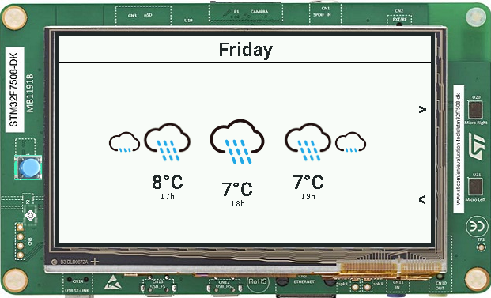

# Weather Report

# Overview

An application that shows the weather in real time at the board location.

The carousel can be dragged to see the weather at different times in the day, and the arrows can be pressed to see the
weather of the next days (up to the next seven days).

# Usage

By default, the sample will use the STM32F7508-DK VEE Port.

Refer to the [Select a VEE Port](https://docs.microej.com/en/latest/SDK6UserGuide/selectVeePort.html) documentation for
more information.

## Run on simulator

In IntelliJ IDEA or Android Studio:

- Open the Gradle tool window by clicking on the elephant icon on the right side,
- Expand the `Tasks` list,
- From the `Tasks` list, expand the `microej` list,
- Double-click on `runOnSimulator`,
- The application starts, the traces are visible in the Run view.

Alternative ways to run in simulation are described in
the [Run on Simulator](https://docs.microej.com/en/latest/SDK6UserGuide/runOnSimulator.html) documentation.

## Run on device

Make sure to properly setup the VEE Port environment before going further.
Refer to the VEE Port README for more information.

In IntelliJ IDEA or Android Studio:

- Open the Gradle tool window by clicking on the elephant on the right side,
- Expand the `Tasks` list,
- From the `Tasks` list, expand the `microej` list,
- Double-Click on `runOnDevice`.
- The device is flashed. Use the appropriate tool to retrieve the execution traces.

Alternative ways to run on device are described in
the [Run on Device](https://docs.microej.com/en/latest/SDK6UserGuide/runOnDevice.html) documentation.

# Requirements

- MICROEJ SDK 6.
- A VEE Port that contains:

    - EDC-1.3 or higher.
    - BON-1.4 or higher.
    - NET-1.1 or higher.
    - SSL-2.2 or higher.
    - MicroUI-3.4 or higher.
    - DRAWING-1.0 or higher.

This example has been tested on:

- IntelliJ IDEA 2024.3.1.
- STM32F7508-DK VEE Port 2.2.0 & 2.3.0.

# Dependencies

All dependencies are retrieved transitively by gradle.

# Source

N/A.

# Restrictions

None.

---

<small>
Copyright 2025 HAJJI Amin.  
Use of this source code is governed by a BSD-style license that can be found with this software.
</small>